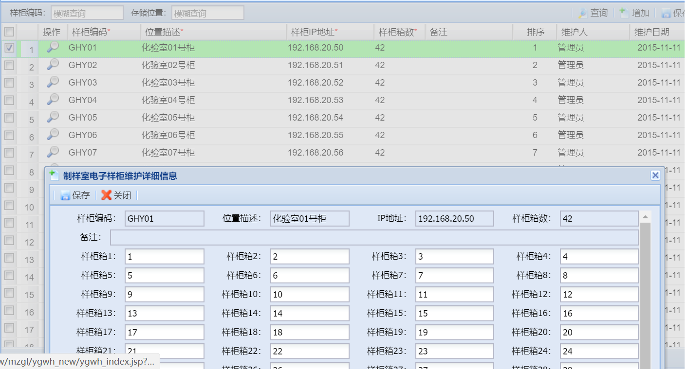

# Lockers-client-masterV2.0

   　　
       
## 总体介绍
 Lockers-client-masterV2.0，是Lockers-client-masterV1.0的升级版，
 
 
 V1.0功能包含：存样、调样、弃样、批量弃样、查看操作记录。
 
 V1.0不足：由于样柜主板没有探物和检测样柜门状态（开或关)的功能，导致系统状态与实际情况不符时，无法做到自动提示。
 
 V2.0升级内容：

- 主板：增加探物、检测样柜门状态的功能。

- 系统：系统状态与操作实际情况不相符时，能自动给出提示，并记录异常记录表。

　
　　
## 开发环境
 
     jdk 1.8 
     sqlserver 2008

　

　　
　　　　　
　　　

## 代码结构  　　

├──libs　　　　　　　　　　　　　　　　　　//项目所需要的jar包

├──src

│　├──main

│　│　├──ClientContext　　　　　　　　　　//GUI的界面控制核心

│　│　├──DqygFrame　　　　　　　　　　　　//到期样柜界面

│　│　├──KeyPanel　　　　　　　　　　　　//数字键盘控制

│　│　├──LoginFrame　　　　　　　　　　　　//登陆界面

│　│　├──LoginMain　　　　　　　　　　　　//登陆主函数

│　│　├──Main　　　　　　　　　　　　　　　　//主函数

│　│　├──MainFrame　　　　　　　　　　　　　//主界面

│　│　├──RecordFrame　　　　　　　　　　//操作记录界面

│　│　├──SoftKey　　　　　　　　　　　　　　//软键盘

│　├──service

│　│　├──BcyjlService　　　　　　　　　//处理被存样记录逻辑

│　│　├──DzygService　　　　　　　　　　//获取样柜箱体逻辑

│　│　├──UDPClient　　　　　　　　　　　//UDP协议操作样柜

│　│　├──UDPThread　　　　　　　　　　

│　├──entity 　　　　　　　　　　　　　　//设置实体类

│　├──db　　　　　　　　　　　　　　　//连接并设置数据库

│　├──Config　　　　　　　　　　　　　　　//配置文件

│　├──resources

│　│　├──bk.gif　　　　　　　　　　　　　//主界面图片

│　│　├──ds.config.xml　　　　　　　　　//连接数据库配置

│　│　├──log4j.properties　　　　　　　//控制日志的生成过程

│　│　├──login_bg.jpg　　　　　　　　　　//登陆背景

│　│　├──system-config.properties　　　　//系统配置文件

├──.gitignore　　　　　　　　　　　　　　//git忽略项

├──build.gradle　　　　　　　　　　　　　//gradle构建

├──settings.gradle　　　　　　　　　　　//gradle设置

├──Readme.md　　　　　　　　　　　　　　//说明

　　　　　　　　　　　　　　　　　　　　　　　　　　　　　　　　　　　　　　　　　　　　　　　　　　　　　　　　　　　　　　　　　　　　　　　　　　　　　　　　　　　　　　
　
## 运行方法
  

- [在eclipse中将项目打包成jar;](./jar.md)

- [通过exe4j将jar打包成exe文件;](./exe.md)

- 运行Lockers-Client_v2.0_fat.exe，弹出主页面后自行选择刷卡登陆或者输入账号密码登陆。

## 项目部署

1. [控制面板的基本操作命令](./rule.md)　　

2. [PC端配置读卡器所需文件](./xml.md) 
 
3. [ds.config.xml文件中连接数据库的信息与所要连接的数据库信息相匹对](./dsconfig.md)  

4. [system-config.properties文件中的时间限制和操作员身份](./sysconfig.md)

5. [数据库中RLGL_SYS_IPTEMP表中的ip要与机器ip相匹配](./ip.md)

## 电子样柜与燃料系统之间的关系

- 制样室电子样柜维护：固定柜子，操作箱子数目，固定ip地址，固定管理人员。  
  

- 化验室电子样柜维护：固定柜子，操作箱子数目，固定ip地址，固定管理人员。  
  

- 采制化人员分配：通过读卡器读取卡号，在PC端绑定卡号与用户信息，从而通过刷卡形式管理控制使用样柜。  

- 登陆电子样柜系统时，工号与密码的查询与设置。

 

